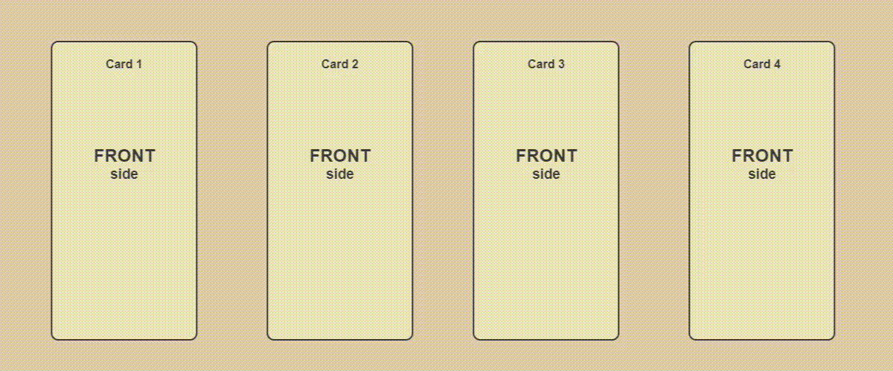
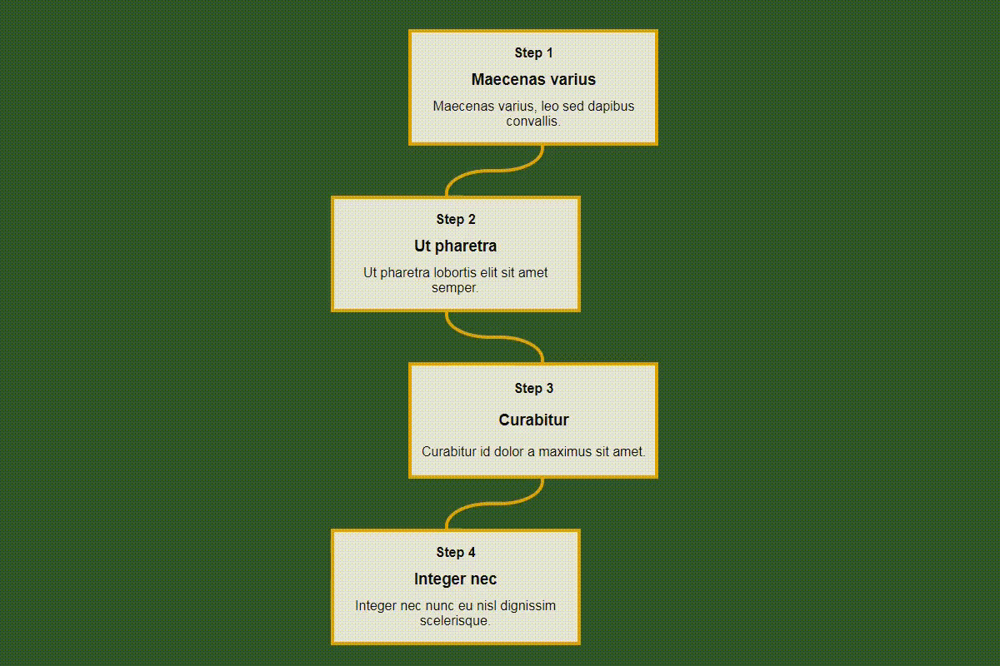
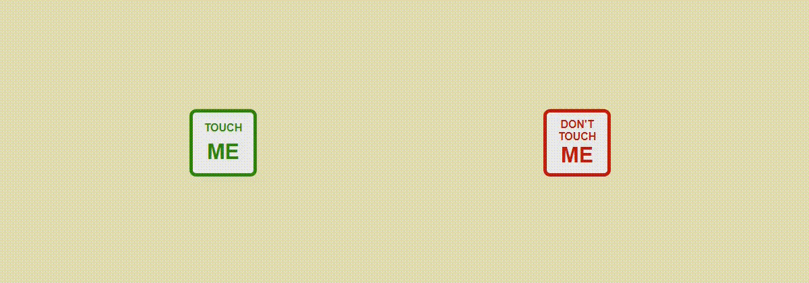
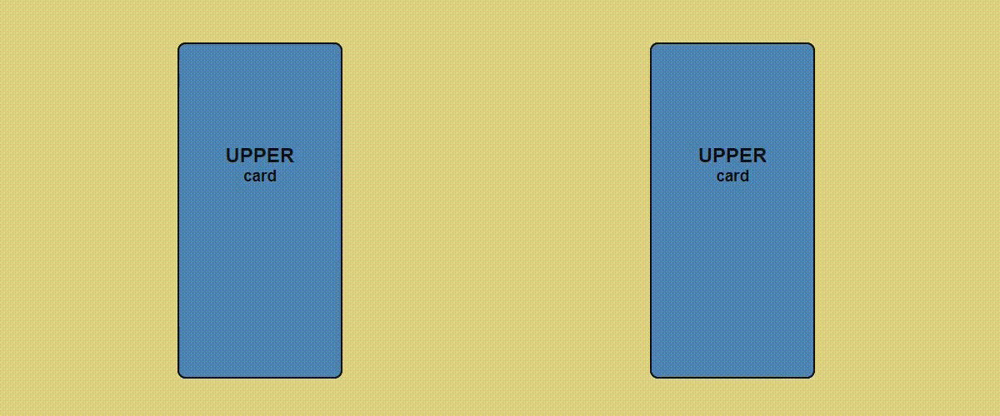
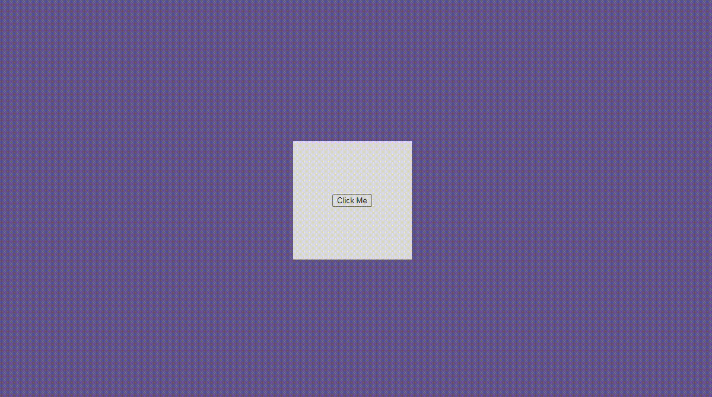

# Web Page 3

This web page contains 6 sections with various functions implemented using JavaScript. There is a vertical scroll indicator on the left side of the page with a link to each section. The user can fold or unfold each section and the indicator reacts accordingly. Demo link is [here](https://kulyk-volodymyr.github.io/web-page-3/).

---

### Section 1

There are four cards. After clicking, the card changes sides (front - back). Card 1 - a simple horizontal flipping, card 2 - flipping width offset, card 3 - like card 1 with perspective, card 4 - like card 2 with perspective. Cards 3 and 4 are hidden on the small screen.

---

### Section 2

Lorem Ipsum instructions in 4 steps. Additional text is extracted after clicking on the step.

---

### Section 3

There are two stickers. Each of them has its own invisible area. When the cursor is in the area, the sticker moves to the cursor or escapes. The Touch Me sticker is hidden on the small screen.

---

### Section 4

There is a picture and its enlarged fragment. When you move the cursor over the picture, the available areas for zooming appear. When pressed, an enlarged selected fragment appears.

---

### Section 5

There are two pairs of cards. Under each card is another. After clicking, the cards change places (upper card - lower card). The first pair has an additional perspective effect. The second pair is hidden on a small screen.

---

### Section 6

After pressing the button, the rectangle expands and the hidden text appears. This feature is not available on a small screen.

